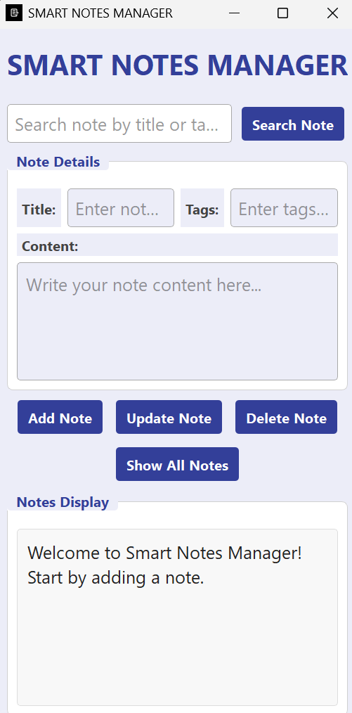

# Smart Notes Manager

A simple yet powerful desktop application for managing notes with a clean, modern graphical user interface. Built with Python, this app helps users create, organize, and search their notes efficiently.

## 🌟 Key Features

* **Create Notes:** Easily add new notes with titles, content, and tags.
* **View All Notes:** Display all stored notes in an organized and styled format.
* **Search Functionality:** Find specific notes quickly by searching for keywords in the title.
* **Update Notes:** Modify the content of existing notes.
* **Delete Notes:** Remove notes from the database permanently.
* **Robust Backend:** Data is securely stored and managed using a local SQLite database.

## 🚀 Technologies Used

This project is built using the following technologies:

* **Python:** The core programming language.
* **PyQt5:** Used for creating the cross-platform graphical user interface (GUI).
* **SQLite:** An embedded database engine for local data storage.
* **HTML & CSS:** Utilized within the `QTextEdit` to style and format the displayed notes for a better user experience.

## ⚙️ How to Run the Application

Follow these simple steps to get the application up and running on your local machine.

1.  **Clone the repository:**
    ```sh
    git clone [https://github.com/](https://github.com/){Alfredox404}/{PyQt-Notes-App}.git
    ```

2.  **Navigate to the project directory:**
    ```sh
    cd {PyQt-Notes-App}
    ```

3.  **Install the required dependencies:**
    ```sh
    pip install PyQt5
    ```

4.  **Run the main application file:**
    ```sh
    python smart_note.py
    ```

## 📸 Screenshots

{Add one or more screenshots or a GIF here to showcase your application's user interface.}



## 🙏 Acknowledgments

This project was developed with guidance and support from an AI assistant, which helped in brainstorming and refining core features.

